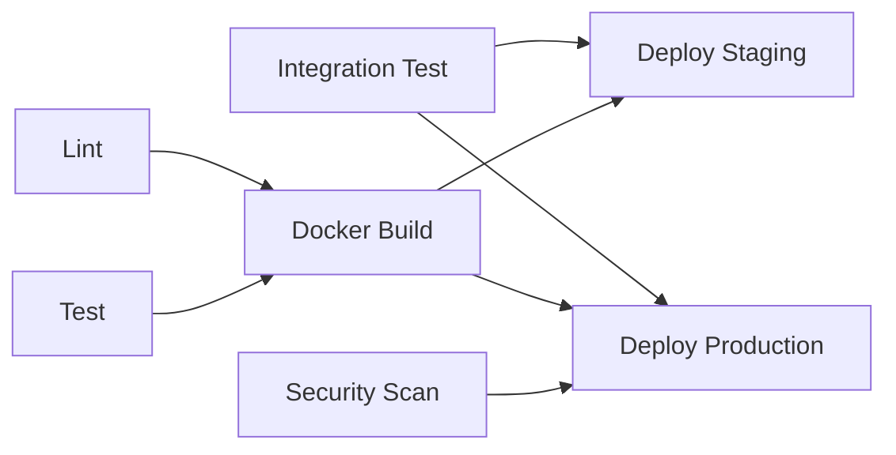

# CI/CD 配置指南

> 自动化测试、构建、部署的完整流程

---

## 📋 概述

MarketBook 使用 **GitHub Actions** 实现 CI/CD 自动化流程，包括：

- ✅ 代码质量检查（ESLint）
- ✅ 自动化测试（单元测试 + 集成测试）
- ✅ 安全漏洞扫描（npm audit + Snyk）
- ✅ Docker 镜像构建与推送
- ✅ 自动部署到 Staging/Production 环境
- ✅ 部署通知与监控

---

## 🚀 快速开始

### 1. 配置 GitHub Secrets

在 GitHub 仓库设置中添加以下 Secrets：

#### 基础配置
```
DOCKER_USERNAME          # Docker Hub 用户名
DOCKER_PASSWORD          # Docker Hub 密码或 Token
```

#### 可选配置（高级功能）
```
CODECOV_TOKEN            # Codecov 测试覆盖率上传
SNYK_TOKEN               # Snyk 安全扫描
SENTRY_AUTH_TOKEN        # Sentry 部署通知
SENTRY_ORG               # Sentry 组织名
SENTRY_PROJECT           # Sentry 项目名
RAILWAY_TOKEN            # Railway 部署 Token
RAILWAY_PROJECT_ID       # Railway 项目 ID
RAILWAY_STAGING_ENV      # Railway Staging 环境 ID
RAILWAY_PROD_ENV         # Railway Production 环境 ID
```

### 2. 启用 GitHub Actions

1. 进入仓库 **Settings → Actions → General**
2. 选择 **Allow all actions and reusable workflows**
3. 保存配置

### 3. 配置 package.json scripts

确保 `package.json` 中包含以下脚本（已完成）：

```json
{
  "scripts": {
    "start": "node src/app.js",
    "dev": "nodemon src/app.js",
    "test": "jest --coverage",
    "test:unit": "jest tests/unit --coverage",
    "test:integration": "jest tests/integration --coverage",
    "test:watch": "jest --watch",
    "lint": "eslint src/**/*.js",
    "lint:fix": "eslint src/**/*.js --fix"
  }
}
```

---

## 📦 工作流详解

### 工作流触发条件

| 事件 | 分支 | 行为 |
|------|------|------|
| Push | `main` | 完整CI → 部署Production |
| Push | `marketbook-development` | 完整CI → 部署Staging |
| Push | `develop` | 完整CI（仅测试） |
| Pull Request | `main`, `marketbook-development` | 完整CI（仅测试） |

### Job 依赖关系



---

## 🔍 各 Job 详解

### 1. Lint Code（代码质量）

**功能**：运行 ESLint 检查代码规范

**配置**：
```yaml
- run: npm run lint
  continue-on-error: true  # 允许警告不阻塞流程
```

**何时失败**：
- 严重语法错误（error级别）
- 不会因为警告（warning）而失败

### 2. Run Tests（单元测试）

**功能**：在多个Node.js版本上运行测试

**Matrix 策略**：
- Node.js 18.x（主版本）
- Node.js 20.x（最新LTS）

**测试覆盖率**：
- 自动上传到 Codecov（需配置 `CODECOV_TOKEN`）
- 生成 `coverage/` 报告

**环境变量**：
```yaml
NODE_ENV: test
JWT_SECRET: test-secret-key-for-ci
JWT_EXPIRES_IN: 24h
```

### 3. Integration Tests（集成测试）

**功能**：启动真实服务（MongoDB + Redis）运行完整流程测试

**服务配置**：
```yaml
services:
  mongodb:
    image: mongo:6.0
    ports: [27017:27017]
  
  redis:
    image: redis:7-alpine
    ports: [6379:6379]
```

**健康检查**：
- MongoDB：`mongosh --eval 'db.runCommand({ ping: 1 })'`
- Redis：`redis-cli ping`
- 每10秒检查一次，最多重试5次

### 4. Security Audit（安全扫描）

**功能**：检测依赖漏洞和安全问题

**工具**：
1. **npm audit**
   - 检查 npm 依赖中的已知漏洞
   - 阈值：moderate（中等）及以上
   - 失败不阻塞（`continue-on-error: true`）

2. **Snyk**（可选）
   - 更详细的漏洞分析
   - 支持修复建议
   - 需配置 `SNYK_TOKEN`

### 5. Docker Build（镜像构建）

**功能**：构建多平台 Docker 镜像并推送到 Docker Hub

**平台支持**：
- `linux/amd64`（x86_64服务器）
- `linux/arm64`（ARM服务器/Apple Silicon）

**镜像标签策略**：
```yaml
tags:
  - type=ref,event=branch           # main, develop, etc.
  - type=ref,event=pr               # pr-123
  - type=semver,pattern={{version}} # v1.2.3
  - type=sha,prefix={{branch}}-     # main-abc1234
```

**缓存优化**：
- 使用 GitHub Actions Cache（`type=gha`）
- 加速重复构建

**安全扫描**：
- Trivy 漏洞扫描
- 结果上传到 GitHub Security（SARIF格式）

### 6. Deploy Staging（部署到测试环境）

**触发条件**：
- Push 到 `marketbook-development` 分支
- 通过所有测试和构建

**部署目标**：
- Railway Staging 环境
- URL: `https://staging.marketbook.example.com`

**健康检查**：
```bash
curl -f https://staging.marketbook.example.com/health
```

### 7. Deploy Production（部署到生产环境）

**触发条件**：
- Push 到 `main` 分支
- 通过所有测试、构建、安全扫描

**部署目标**：
- Railway Production 环境
- URL: `https://marketbook.example.com`

**健康检查**：
```bash
curl -f https://marketbook.example.com/health
curl -f https://marketbook.example.com/health/ready
```

**部署通知**：
- Sentry 发布记录（关联错误监控）
- 企业微信/Slack 通知（可选）

---

## 🛠️ 本地测试 CI 流程

### 1. 运行 Lint

```bash
npm run lint
```

**预期输出**：
```
✔ No ESLint errors found
⚠ 3 warnings (can be ignored)
```

### 2. 运行单元测试

```bash
npm test
```

**预期输出**：
```
Test Suites: 9 passed, 9 total
Tests:       180 passed, 180 total
Coverage:    78.5% Statements | 72.3% Branches
```

### 3. 运行集成测试（需 Docker）

```bash
# 启动服务
docker-compose -f docker-compose.dev.yml up -d mongodb redis

# 运行测试
npm run test:integration

# 清理
docker-compose -f docker-compose.dev.yml down
```

### 4. 构建 Docker 镜像

```bash
docker build -t marketbook:local .
docker run -p 3000:3000 --env-file .env marketbook:local
```

---

## 📊 CI 状态徽章

在 README.md 中添加状态徽章：

```markdown
[](https://github.com/fisher-byte/Marketbook/actions/workflows/ci.yml)
[](https://codecov.io/gh/fisher-byte/Marketbook)
[](https://hub.docker.com/r/fisher-byte/marketbook)
```

---

## ⚠️ 常见问题

### Q1: CI 失败：npm audit 发现高危漏洞

**解决方案**：
```bash
# 查看详情
npm audit

# 自动修复
npm audit fix

# 强制修复（可能破坏兼容性）
npm audit fix --force

# 忽略特定漏洞（临时）
npm audit --audit-level=critical
```

### Q2: Docker 构建超时

**解决方案**：
1. 检查 `.dockerignore` 是否正确排除 `node_modules`
2. 使用多阶段构建减少层数
3. 优化依赖安装顺序（package.json 先拷贝）

### Q3: 集成测试失败：无法连接 MongoDB

**解决方案**：
1. 检查 `services` 配置中的健康检查
2. 增加 `sleep 10` 等待服务启动
3. 使用 `--health-retries` 增加重试次数

### Q4: Staging 部署成功但 Production 不部署

**原因**：Production 需要手动批准（GitHub Environments 保护规则）

**解决方案**：
1. 进入 **Settings → Environments → production**
2. 添加 **Required reviewers**（至少1人审批）
3. Push 到 `main` 后，去 Actions 页面点击 **Review deployments**

---

## 🔐 安全最佳实践

### 1. Secrets 管理

❌ **不要**：
```yaml
- run: echo "JWT_SECRET=my-secret-key" >> .env  # 明文暴露
```

✅ **应该**：
```yaml
- run: echo "JWT_SECRET=${{ secrets.JWT_SECRET }}" >> .env
```

### 2. 敏感数据脱敏

测试日志中可能包含敏感信息：

```yaml
- name: Run tests
  run: npm test 2>&1 | sed 's/password=.*/password=***/g'
```

### 3. 镜像扫描

始终启用 Trivy 扫描：

```yaml
- uses: aquasecurity/trivy-action@master
  with:
    severity: 'HIGH,CRITICAL'
    exit-code: '1'  # 发现高危漏洞时失败
```

---

## 📚 延伸阅读

- [GitHub Actions 官方文档](https://docs.github.com/en/actions)
- [Docker 多阶段构建最佳实践](https://docs.docker.com/develop/dev-best-practices/)
- [Jest 集成测试指南](https://jestjs.io/docs/tutorial-react)
- [Railway 部署文档](https://docs.railway.app/)
- [Sentry 错误监控集成](https://docs.sentry.io/platforms/javascript/guides/node/)

---

## 🎯 下一步优化

- [ ] 添加 E2E 测试（Playwright/Cypress）
- [ ] 集成 SonarQube 代码质量分析
- [ ] 实现蓝绿部署/金丝雀发布
- [ ] 添加性能回归测试（K6/Artillery）
- [ ] 自动化数据库迁移（Flyway/Liquibase）

---

**最后更新**：2026-02-09  
**维护者**：MarketBook Team
